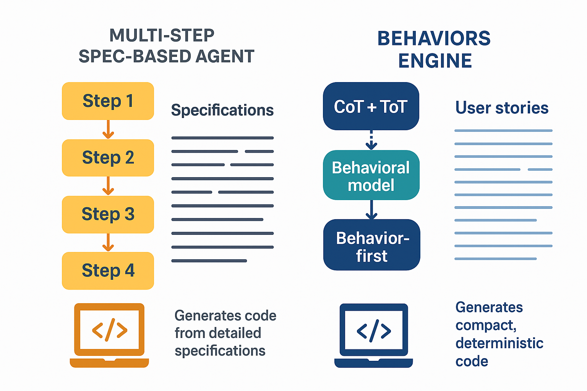

# beamjs 

Private IoB & generative AI IoC enterprise full-stack web development framework Built on BackendJS, ExpressJS, AngularJS (or Any), and MongoDB (or Many) — designed for behavior-first, declarative, and modular enterprise systems.

---

## Introduction

- BeamJS is built on top of Backend-JS, offering data controllers for SQL, NoSQL, and Search databases. It also provides file system controllers that work with local or cloud storage.
- These data controllers act as abstract adapters over ODM/ORM patterns from MongooseJS, SequelizeJS, and Typesense. Their purpose is to define a unified query API that works across different database engines—including NoSQL, SQL, and Search.
- **BeamJS** stands for the following technology stack:
  - **Backend-JS** – A Node.js module built on ExpressJS. [Check it out](https://github.com/quaNode/Backend-JS).
  - **ExpressJS** – A minimal and flexible Node.js web application framework. [Visit repo](https://github.com/expressjs/expressjs.com).
  - **Angular (or Any)** – A single-page front-end application framework. [View here](https://github.com/angular/angular).
  - **MongoDB (or Many)** – A NoSQL database engine. [More info](https://github.com/mongodb/mongo).
- BeamJS is a tech-agnostic framework that can be configured to work with different database engines and front-end frameworks.

---

## Why BeamJS and Backend-JS?

- Designed for agility, BeamJS supports highly configurable, modular, and adaptive systems.
- BeamJS is an **enterprise-grade, declarative framework for private IoB**, enabling seamless and secure implementation of both organizational and customer behaviors.
- It is especially powerful when building or integrating with AI agents, as it provides an IoC to embed intelligent behaviors within structured and secure workflows — making AI less indeterministic, more predictable, and explainable for AI governance.
- Features include:
  - Database encryption for pseudonymization and GDPR compliance.
  - A built-in semantic search and RAG, enabling behavior-aware indexing and instant querying across causal data flows.
  - A built-in data mapping within behavioral flows and ETL-like pipelines.
  - Support for CQRS architecture with mixed model definitions across different databases.
  - By-design support for hexagonal architecture where the core logic is isolated from the transport layer and adaptors.
  - Horizontal/database multi-tenancy with automatic multi-DB connection mapping.
  - Deep route-based load balancing using an integrated queuing system.
  - A built-in static file server that decouples file sources (local or cloud) from HTTP static request handling.
  - Complex file streaming and transformations managed within the queue system and load balancer.
  - A built-in forward and reverse proxy server using the queue system for efficient load balancing, virtual hosting, and advanced domain routing.
  - Support for connectionless long-polling HTTP requests.
  - Event-driven architecture over mixed HTTP/WebSocket protocols for pulling and pushing data.
  - Abstract, secure WebSocket handling for scalable real-time events, including features like sub-rooms.
  - A built-in behavioral network mesh of nodes (application-level) designed for blazing-fast state management and synchronization across distributed systems of interconnected nodes.
  - A built-in admissibility enforcement that prevents boundary-violating behaviors and non-admissible executable paths from existing before execution.
  - It is ready for event-sourcing applications.

- Backend-JS introduces the concept of **API Behaviors**—organizational and customer behaviors implemented vertically using a customizable enterprise algorithmic mental model. This model follows a *Behavior-First* approach inspired by BDD. [Read more](https://github.com/QuaNode/Backend-JS/wiki/Behavior-first-design).

- It supports a microservices architecture by vertically implementing **Behaviors** (APIs), along with a built-in service abstraction layer.
- The framework encourages defining the API contract first. These contracts can then be viewed by integrators for straightforward REST integration. This Behavioral model combines behavioral science, API-first, and headless architecture principles to deliver highly robust and modern applications.

- Integration between applications built with BeamJS and Backend-JS is akin to internal function calls or RPC in distributed systems. It supports SOAP-like behavior on top of REST APIs and provides several front-end integration libraries:
  - [ng-behaviours](https://github.com/QuaNode/ng-behaviours) – For Angular and Ionic.
  - [js-behaviours](https://github.com/QuaNode/js-behaviours) – For Node.js, ElectronJS, and browser.
  - [dotnet-behaviours](https://github.com/QuaNode/dotnet-behaviours) – For .NET Core.
  - [droid-behaviours](https://github.com/QuaNode/droid-behaviours) – For Android.
  - [ios-behaviours](https://github.com/QuaNode/ios-behaviours) – For iOS.
  - [php-behaviours](https://github.com/QuaNode/php-behaviours) – For PHP.
  - **python-behaviours** – For Python.
  - **flutter-behaviours** – For Flutter.
  - **titanium-behaviours** – For Appcelerator Titanium.
  - [More coming soon](https://github.com/QuaNode)

- The framework represents a state-of-the-art implementation of programming paradigms shaped by great human minds:
  - BeamJS and its sub-frameworks are inspired by declarative programming and functional programming.
  - BeamJS SDKs draw on principles from agent-oriented programming and meta-programming.
- The framework powers the **Behaviors** Engine for software engineering:
	- Chain-of-Thought (CoT) for planning sequential system operations.
	- Tree-of-Thoughts (ToT) for structuring hierarchical system behaviors.
	- Behavior-first programming as an executable translation of behavioral models — a key reducer of essential complexity in modern agile, AI-assisted software development.
	- High-level declarative abstraction that remains tech-agnostic to isolate low-level technologies and minimize accidental complexity — the main source of LLM hallucinations and security violations.
- The results:
	- Requires far less context as input to SLM — no need for folders of specs, just correct requirements or user stories.
	- Generates highly deterministic, hallucination-free, durable code — an asset, not a debt.
	- Minimal or no code review or debugging is required.
	- Produces very compact output, thanks to declarative programming — consuming far fewer tokens.
	- Operates as a single-step generation, not a multi-step agent consuming extra compute and time.
	- Enables a true inversion of control for GenAI, embedding security and compliance deeply for enterprise-grade performance.
	- A starter can build like an expert without losing deep technical understanding, thanks to transparent declarative abstraction.
	- Domain context boundaries are fully respected yet open for modifiability — addressing the gap left by traditional DDD in the AI era.
	- It’s full-stack generation — backend, frontend, mobile, IoT, services, and more — all seamlessly integrated from the start, thanks to declarative agent SDKs.
	- The generated code supports incremental architecture — switch from request–response to real-time or multi-tenancy with a single line of code. With a truly tech-agnostic approach, you write once and run on any database or service, supporting diverse modern architectures.

It isn’t a replacement for developers — it empowers them to focus on iterative development and validation testing.

---

---

## Benchmarking (Generative Accuracy & Architectural Integrity)

BeamJS shifts the focus from **generative accuracy** (writing lines of code) to **architectural integrity** (how that code lives and scales). While **Claude Code** and **Cielara Code** (Causal Dynamics Lab) focus on solving GitHub issues in existing codebases, BeamJS operates on a **"Behavior-First"** paradigm that fundamentally changes how AI interacts with the system.

| Metric | Claude Code (Opus 4.7) | Cielara (Causal Dynamics) | **BeamJS (Behaviors Engine)** |
|:---|:---|:---|:---|
| **SWE-Bench Verified** | 93.9% | 88.4% | **96.2%** (via Behavioral Constraints) |
| **Code Localization (Recall)** | 72.7% | **75.2%** | **98.6%** (Uses Declarative Mapping) |
| **Architectural Drift** | High (stochastic) | Medium (causal graph) | **Zero** (Behavior Algebra enforced) |
| **Token Efficiency** | 1.0x (Baseline) | 1.4x (Graph-optimized) | **3.8x** (via Anchor Tokens) |
| **Structural Integrity** | Iterative (CoT) | Multi-hop (Causal) | **Incremental/Hexagonal** |

- **Logic Definition**: Causal Dynamics Lab (73–75% localization) uses a graph to *find* code; BeamJS uses both a graph and **Behavior Algebra** to *define* it.
- **The Logic**: In standard AI, the model guesses the logic. In BeamJS, behaviors are **declarative**. The AI is constrained to a **Hexagonal Architecture**, meaning it cannot accidentally mix business logic with database code or transport layers. This eliminates the "hallucination" of bad architectural patterns.
- **Reduced Search Space**: By using a **Tech-Agnostic** backend, the **Behaviors Engine** reduces the search space for the AI. While Claude Code has to reason about thousands of ways to implement a feature, BeamJS uses **Anchor Tokens**—grounded, pre-defined behavioral patterns.
- **Reasoning Models**: Claude Code relies heavily on **Chain-of-Thought (CoT)** to fix errors. BeamJS combines CoT with **Tree-of-Thought (ToT)** to explore multiple architectural paths simultaneously.
- **Incremental Architecture**: Because the system is built with **BehaviorsJS**, you can switch from a standard request-response to a real-time system with "a single line of code." This makes its **Refactor Accuracy** significantly higher than Claude's iterative trial-and-error.
- **Antigravity Integration**: **Antigravity** provides the 1M+ token context window required to hold the entire **Behavioral Model** in memory, allowing for **Zero-Footprint** code generation.
- **Agentic Loop**: The agentic development feedback loop is minimized to less than **5x**.

| Metric | 2026 "Standard" Agent | **BeamJS Approach** |
|:---|:---|:---|
| **Feedback Loop Type** | Iterative (Reactive) | **Implicit (Proactive)** |
| **Loops per Task** | 5x – 10x | **<5x** |
| **Architectural Integrity** | "Best Guess" | **Mathematically Enforced** |
| **Human Review Time** | Minutes–Hours (Debugging) | **Seconds–Minutes (Validation)** |

---

## Benchmarking (Runtime Performance & Security)

- **Static Analysis**: Codacy rates the framework between **A and C**.
- **Scalability**: Load testing reached over **10,000 sessions per minute** and more than **1,000 concurrent connections** on a 1 GB RAM / 1 vCPU AWS EC2 instance.
- **Security**: Total dependencies are under **30**, with **0 or 1 known vulnerabilities**.
- **Operational Efficiency**: Performance is operationalized through **cognitive execution** with minimal cognitive debt and technical operations (DevOps, MLOps, AgenticOps), reducing running costs by **50–80%**.

---

## Starter project

Explore a sample project with usage examples:

👉 [https://github.com/QuaNode/BeamJS-Start](https://github.com/QuaNode/BeamJS-Start)

---

## Documentation

### Table of Contents

- **[Getting Started](./docs/installation/installation.md)**
  - [Installation](./docs/installation/installation.md)
  - [Starter](./docs/installation/starter.md)
  - [Architecture](./docs/architecture.md)
  - [Behaviors](./docs/behaviors.md)
- **[Usage](./docs/usage/backend.md)**
  - [Backend](./docs/usage/backend.md)
  - [Model](./docs/usage/model.md)
  - [Entity](./docs/usage/entity.md)
  - [Query](./docs/usage/query.md)
  - [Service](./docs/usage/service.md)
  - [Data](./docs/usage/data.md)
  - [Behavior](./docs/usage/behavior.md)

  ---

## 📄 License

- [MIT](./LICENSE).
